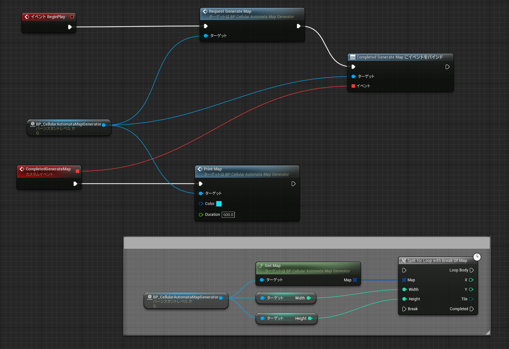

# Cellular Automata Map for Unreal Engine
Cellular Automata を用いたマップ生成 for Unreal Engine

## 留意事項
- エンジンバージョン : 5.1.1
- Blueprint Onlyで実装しています
- 対策していますがプチフリが発生する場合があります。

## 使い方
- レベルに直接配置やスポーン、ChildActorなどでBP_CellularAutomataMapGeneratorを生成します。

- 下記のようにBPを組みます(実際にはPrintMapの部分はコメントで囲っている部分と差し替えてマップ生成に利用します)

- PrintMapによる出力例

## 参考
- [Roguelike Development Resources](https://github.com/marukrap/RoguelikeDevResources)
- [Cellular Automata Method for Generating Random Cave-Like Levels](http://www.roguebasin.com/index.php?title=Cellular_Automata_Method_for_Generating_Random_Cave-Like_Levels)
